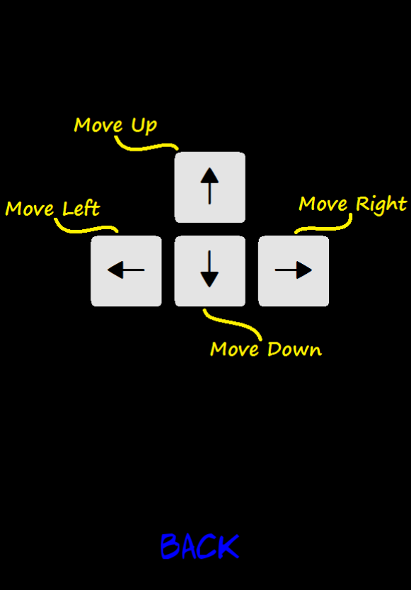

Pacman
---
### Initial informations ###
In this repository you will find my version of Pacman game created using:

* C++
* [SFML](https://www.sfml-dev.org/) library
* Textures from [OpenGameArt](https://opengameart.org/) - Thank you Carlos Alface for Pacman textures.
* Fonts: [Aller](https://www.fontsquirrel.com/fonts/aller) and [Adam Warren Pro](https://www.dafont.com/adam-warren-pro.font)\
* Current version completed on 29 May 2019.
\
*Repository contains Visual Studio project and source code. You can use it and run it inside this IDE or use only source code and compile it in your favourite IDE (**Please remember about linking SFML**).*

---
### Overview ###

Here you can see pictures from game:

Start menu | Control menu
------------- | -------------
  |  

Playing is simple and intuitive: 
* You will have three lives.
* Each contact wiht ghost will take one life from you. 
* Try to score as much points as you can. 
* Remember about special bonus which appears from time to time in the middle of map.
* After game type your name and compare your result to other players!

Game | Score Board
------------- | -------------
  |  

---
### Additionals ###
Source code includes also a simple map generator (in *mapGeneratorModule* folder). It allows you to create your own map and place the bonuses or balls where you want.

Map generator window | Bonus placing window
------------- | -------------
  |  

**How to use it?**\
If you want to try it out you need to uncomment lines in *Source.cpp* there is also small instruction how to use it. 
After creating map please replace original files name in *costantsDef.h*.

